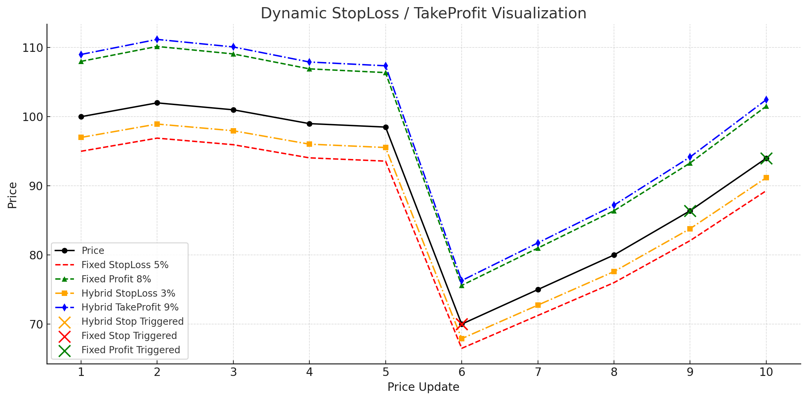

# Strategy Usage Example

This example demonstrates how to use the Quant trading strategy engine with various stop-loss and take-profit strategies.

## Overview

The strategy engine supports multiple types of trading strategies:

- **Fixed Percent Stop/Profit**: Percentage-based exit points
- **Trailing Stop/Profit**: Dynamic stops that lock in gains
- **ATR-based Strategies**: Volatility-adjusted stops using Average True Range
- **Moving Average Strategies**: MA-based dynamic stops
- **Hybrid Strategies**: Combined stop-loss and take-profit

## Visual Workflow

The diagram above illustrates how the strategy engine processes price updates and triggers callbacks when conditions are met.

## Quick Start

## Complete Example

See [`stragety_example.go`](./stragety_example.go) for a full working example with:
- Multiple strategy registration
- Simulated price movements
- Callback handling
- Proper lifecycle management

## Strategy Types

### Fixed Strategies
- `NewFixedPercentStop`: Fixed percentage stop loss
- `NewFixedPercentProfit`: Fixed percentage take profit

### Trailing Strategies
- `NewFixedTrailingStop`: Trails up to lock in gains
- `NewFixedTrailingProfit`: Trails down to secure profits

### ATR Strategies
- `NewFixedATRStop`: ATR multiplier-based stop loss
- `NewFixedATRProfit`: ATR multiplier-based take profit

### Moving Average Strategies
- `NewFixedMovingAverageStop`: MA + offset stop loss
- `NewFixedMovingAverageProfit`: MA + offset take profit

### Hybrid Strategies
- `NewRiskRewardRatio`: Combined stop loss and take profit
- `NewStructeSwing`: Combine interregional min and max to regression

